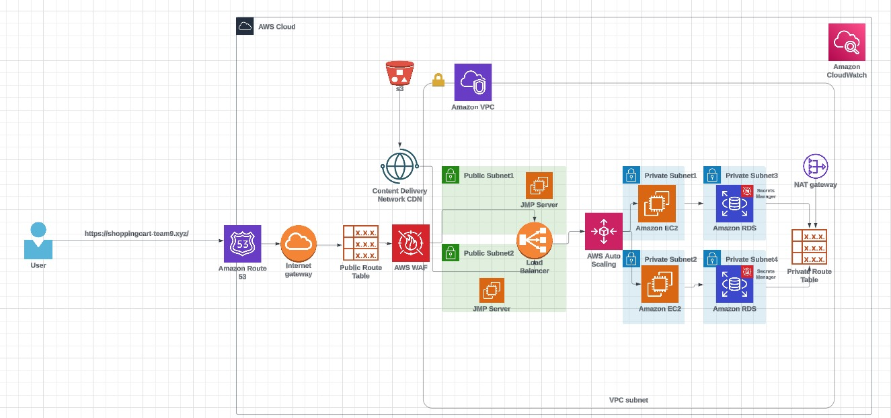

# E-Commerce-AWS deployment
In this project, I deployed a shopping website using a 3-tier architecture on AWS, ensuring high availability, scalability, and security.

## Architecture Overview:

#### Presentation Layer:
Utilized Amazon CloudFront as a Content Delivery Network (CDN) to cache and distribute static content globally, reducing latency and improving load times for users.

#### Application Layer:
Deployed EC2 instances in an Auto Scaling group across multiple Availability Zones (AZs) to handle varying traffic loads and ensure high availability.

#### Data Layer: 
Employed Amazon RDS with Multi-AZ deployments to store data, providing automatic failover and enhanced durability.

### Key Features:

#### Auto Scaling: 
Configured Auto Scaling to dynamically adjust the number of EC2 instances based on traffic demands, ensuring optimal performance and cost efficiency.

#### Load Balancing: 
Implemented Elastic Load Balancer (ELB) to distribute incoming traffic evenly across EC2 instances, preventing any single instance from becoming a bottleneck.

#### Multi-AZ Deployment:
Deployed resources across multiple AZs to eliminate single points of failure, enhancing the application's fault tolerance.

#### Data Security: 
Ensured data encryption both in transit and at rest using aws Kms, safeguarding sensitive customer information.

#### Content Delivery Optimization: 
Integrated Amazon CloudFront to serve static content from S3 buckets, reducing latency and improving user experience.

 This architecture design ensures that the shopping website can handle high traffic volumes, maintain high availability, and provide a secure and fast shopping experience for users.

